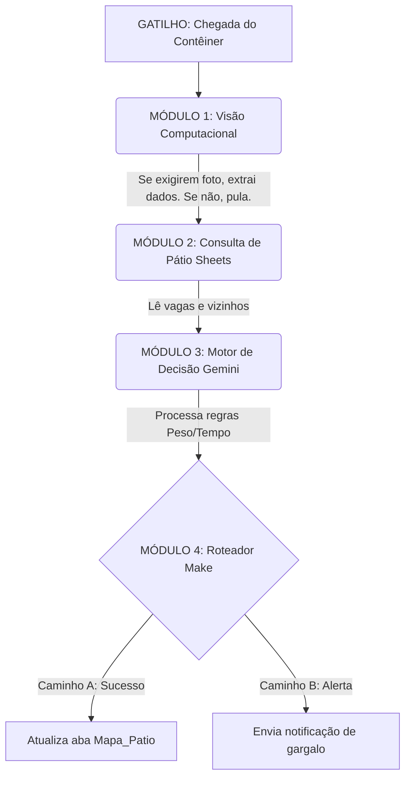

# Apresentação: Torre de Controle Logística (Desafio 2)

---

## 🏗️ O Problema: "O Ponto Cego" Operacional

O cenário atual da gestão de pátio apresenta gargalos críticos:

* **Falta de Visibilidade 360º:** Decisões tomadas com base no "visual" do momento, sem predição.
* **Silos de Informação:** Dados divididos entre planilhas estáticas e sistemas de difícil acesso.
* **Retrabalho (Shifting):** Alocações ineficientes que geram movimentações extras e desnecessárias da empilhadeira/Reach Stacker.

---

## 🎯 A Estratégia: O MVP ("Menos é Mais")

Em vez de tentar abraçar um sistema YMS (Yard Management System) inteiro em uma semana, o foco é construir o **Motor de Regras**.

* **Arquitetura Desacoplada:** Separação clara entre Ingestão (Input), Processamento Lógico (Cérebro) e Armazenamento (Output).
* **Foco no "Caminho Feliz" Inteligente:** Garantir que a alocação de um contêiner no pátio seja feita pela máquina, eliminando o erro humano e otimizando espaço.

---

## ⚙️ A Arquitetura da Solução

Fluxo de dados automatizado, sem necessidade de treinamento de modelos do zero.

1. **Input (Gatilho):** Recepção dos dados do contêiner (ID, Peso, Previsão de Saída) via Webhook/Formulário.
2. **Contexto (Database):** Consulta em tempo real das vagas e níveis disponíveis no pátio (Google Sheets).
3. **Decisão (IA Multimodal):** Gemini atuando como Roteirizador Lógico.
4. **Output (Ação):** Atualização do mapa do pátio e registro de log de movimentação via Make.

---

## 🧠 O Motor de Decisão (Regras de Negócio)

A IA não "adivinha", ela calcula a melhor posição baseada em três pilares hierárquicos:

* **1. A Regra do Tempo (Prioridade Máxima):** Contêineres com saída próxima NUNCA ficam sob contêineres de saída tardia (evita retrabalho).
* **2. A Regra do Peso:** Contêineres pesados ficam na base; leves podem ser empilhados (se a Regra 1 permitir).
* **3. A Regra da Eficiência (Zonas):** Direcionar saídas rápidas (Hot Zone) para perto do portão, poupando combustível e tempo da máquina.

---

## 📦 Modelando o Mundo Real: A Física do Pátio

Para evitar alucinações da IA (como o "contêiner voador"), o sistema reflete a geometria tridimensional do porto.

* **Nomenclatura Oficial:** O mapeamento abandona termos genéricos e adota o padrão **Rua + Posição + Nível (Tier)**.
* **Exemplo Prático:** `A1-N1` (Base), `A1-N2` (Meio), `A1-N3` (Topo).
* **A Regra da Gravidade:** A IA e o sistema de filtragem sabem que um nível `N2` só existe como vaga válida se o nível `N1` correspondente estiver fisicamente ocupado.

---

## 🚀 Próximos Passos e Escalabilidade

O que este MVP prova e como ele pode evoluir no futuro:

* **Hoje:** Automação baseada em dados estruturados (JSON/Formulários).
* **Amanhã (Expansão):** Capacidade de substituir o Input por **Visão Computacional**. Câmeras capturam a porta do contêiner (OCR/Zero-shot detection), enviando os dados para o *mesmo* fluxo lógico, sem necessidade de reescrever a arquitetura.

