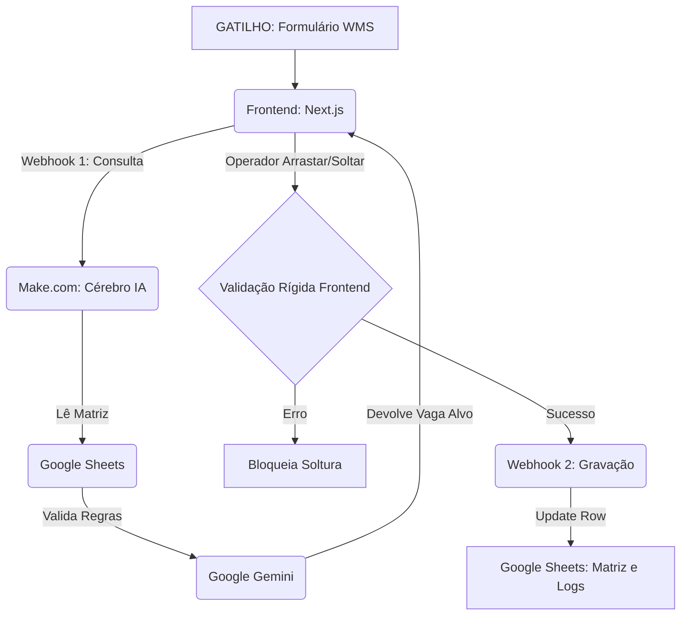

# 🏗️ Argos: Torre de Controle para Armazém Autoportante


**🔗 Aplicação Online:** [https://terminal-yms-ws.vercel.app/](https://terminal-yms-ws.vercel.app/)

---

## 📌 Visão Geral

O **Projeto Argos** é a evolução do sistema de gestão de pátios da Wilson Sons. Diferente da versão anterior voltada para contêineres, esta implementação foca no **Armazém Autoportante** de alta densidade. O sistema funciona como um Gêmeo Digital (Digital Twin) interativo, com motor de decisão assistido por IA (Gemini), integrando interface em tempo real, validação física de arrastar-e-soltar e regras logísticas automatizadas.

### ✨ Novidades da v3.0.0
* **Trava Mecânica de Alocação (Drop UI):** O Gêmeo Digital agora possui um bloqueio rígido. O contêiner ("Ghost Container") não se solta do mouse do operador caso a vaga clicada divirja da coordenada validada pela IA.
* **Renderização Determinística de Zonas:** A cor de background das vagas é processada em tempo real extraindo o prefixo físico do pátio direto do front-end, garantindo imunidade contra anomalias de planilhas.
* **Persistência de Raciocínio (AI Justification):** As justificativas técnicas do Gemini agora são capturadas na interface e retransmitidas para o log oficial de movimentação no Google Sheets.

---

## 🧠 Motor de Decisão e Engenharia de Prompt

A IA processa o estado atual do armazém aplicando restrições críticas baseadas em um prompt de sistema estrito (`/docs/AI_PROMPT_ENGINEERING.md`). As regras incluem:

1. **Segurança (Cargas IMO):** Produtos perigosos são isolados exclusivamente na RUA 5.
2. **Produtividade (Ocupação < 40%):** A IA restringe a alocação aos níveis N1-N4 quando a ocupação global está baixa.
3. **Física do Armazém e Gravidade:** Matriz expandida de 7 andares (Eixo Z), exigindo que empilhamento seja decrescente (mais pesado na base) e proibindo contêineres flutuantes (nível N(x) exige N(x-1) ocupado).

---

## ⚙️ Arquitetura de Microsserviços (Make.com)

O backend opera através de uma arquitetura baseada em automações de baixo código, dividida em dois fluxos distintos para separar responsabilidades:

1. **Microsserviço: Torre de Controle (Cérebro IA):** Lê o estado da matriz 3D via Google Sheets, cruza os dados do contêiner com as 8 regras logísticas usando o **Google Gemini 1.5 Flash**, e devolve um payload JSON com o `targetSlot` ideal e sua justificativa.
2. **Microsserviço: Gravação de Movimentação (Braço Mecânico):** Ativado de forma assíncrona após o evento de *Drag and Drop* validado no front-end. Ele atualiza o banco de dados oficial e executa o log histórico de movimentação.



---

## 📂 Estrutura do Repositório

```text
├── app/                  # Rotas e Layouts (Next.js App Router)
├── components/           # Componentes Modulares e UI interativa
│   ├── container-grabber.tsx # Lógica de fisgar o contêiner
│   ├── ghost-container.tsx   # Elemento flutuante preso ao ponteiro (Sticky Drag)
│   ├── movement-form.tsx     # Formulário logístico (Peso, IMO, Data)
│   ├── status-alerts.tsx     # HUD de alertas de divergência
│   ├── terminal-dashboard.tsx# Orquestrador central e travas de validação
│   ├── yard-filters.tsx      # Filtros combinados multi-critérios
│   └── yard-map.tsx          # Renderizador da Matriz 3D (Zonas coloridas via ID)
├── lib/                  # Regras de Domínio e Tipagens (Yard.ts)
├── backend/              # Blueprints da automação Make.com
│   ├── blueprint-roteirizador.json
│   └── blueprint-gravacao-movimentacao.json
└── docs/                 # Governança e Arquitetura
    ├── AI_PROMPT_ENGINEERING.md
    ├── FLOW_ARCHITECTURE.pdf
    └── vercel-prod-env-setup.png

```

---

## 🛠️ Tecnologias Utilizadas

* **Frontend:** React 19, Next.js 16, TypeScript, Tailwind CSS v4, Shadcn/UI, Lucide React.
* **Backend/Orquestração:** Make.com (Low-Code/No-Code Integration).
* **IA Cognitiva:** Google Gemini API (Prompt Engineering focado em Json Parsing estrito).
* **Database:** Google Sheets (Matriz de estados).

---

## 🚀 Como Executar Localmente

### Pré-requisitos

* Node.js (v18+)
* NPM ou PNPM
* Conta ativa no Make.com

### Passos de Instalação

1. **Clone o repositório:**

```bash
git clone [https://github.com/Eduardo377/argos-wms-digital-twin.git](https://github.com/Eduardo377/argos-wms-digital-twin.git)

```

2. **Instale as dependências:**

```bash
pnpm install

```

3. **Configure as variáveis de ambiente:**
Crie um `.env.local` na raiz contendo seus webhooks de teste:

```env
NEXT_PUBLIC_WEBHOOK_URL="sua_url_consulta_ia_aqui"
NEXT_PUBLIC_WEBHOOK_GRAVACAO_URL="sua_url_gravacao_aqui"
NEXT_PUBLIC_MAPA_PATIO_CSV_URL="sua_planilha_csv_aqui"

```

4. **Inicie o servidor:**

```bash
pnpm dev

```

---

## 🔒 Deploy em Produção (Vercel)

Em produção, não utilizamos o arquivo `.env.local`. As URLs oficiais do ambiente (conta Make principal e planilhas oficiais) estão cadastradas diretamente de forma segura nas configurações do projeto na Vercel (*Settings > Environment Variables*).

Lembre-se de realizar um *Redeploy* sempre que alterar as chaves de integração.

---

## 🎓 Créditos e Contexto

Projeto desenvolvido como parte do desafio técnico da **KODIE Academy** em parceria com a **Wilson Sons**.

* **Versão:** 3.0.0
* **Status:** Estável (Refatoração estrutural de validação concluída).

---

## 👨‍💻 Desenvolvido por

<table>
  <tr>
    <td align="center">
      <a href="https://www.linkedin.com/in/eduardogomes377">
        
      </a>
    </td>
    <td>
    <strong>Eduardo Andrade</strong><br/>
      <em>Full Stack Developer</em><br />
      <em>Security Engineer</em><br><br />
      <a href="https://www.linkedin.com/in/eduardogomes377" target="_blank">
        
      </a>
      <a href="mailto:eduardogomes377@gmail.com" target="_blank">
        
      </a>
    </td>
  </tr>
</table>